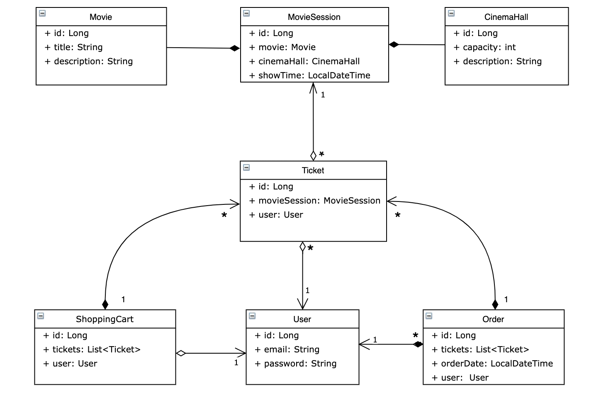

# 🍿 Cinema app 🎬
## Project summary
This project is a web application that allows to use and manage movie theater service with its database. It has such functionality like authorization (user/admin), editing and reading data about movies/cinema halls/movie sessions/tickets, managing users/tickets/shopping carts/orders.
## Used technologies
- Java (JDK 17)
- Spring Web MVC
- Spring Security
- Hibernate
- MySQL
- Tomcat
- Maven
## Functionality
### 🔑 Authorisation
- ***POST: /register*** - register as a new user
- ***POST: /login*** - log in as a user/admin
- ***GET: /logout*** - log out :)
### 🛒 Ordering (user access level)
- ***PUT: /shopping-carts/movie-sessions?movieSessionId*** - add a new ticket to user's shopping cart
- ***GET: /shopping-carts/by-user*** - display current user's shopping cart
- ***POST: /orders/complete*** - create a new order based on user's shopping cart contents
- ***GET: /orders*** - display current user's order history
### 🔎 Info center (user/admin access level)
- ***GET: /movies*** - display info about all movies
- ***GET: /movie-sessions/available?movieId&date*** - display available movie sessions for specified movie and date
- ***GET: /cinema-halls*** - display all cinema halls
### 📁 Managing (admin access level)
- ***GET: /users/by-email?email*** - display info about some user by his email
- ***POST: /movies - add a new movie*** (requested params: title and (optional) description)
- ***POST: /cinema-halls*** - add a new cinema hall (requested params: capacity and (optional) description)
- ***POST: /movie-sessions*** - add a new movie session (requested params: movieId, cinemaHallId and showTime)
- ***PUT: /movie-sessions/{id}*** - update info about some movie session by its id
- ***DELETE: /movie-sessions/{id}*** - delete some movie session by its id
## Structure
This project implement 3-tier architecture and follows SOLID principles. So it has the next internal structure:
- **config** directory contains main configuration classes 
- **controller** directory contains controllers for processing requests
- **dao** directory contains classes for DB manipulating
- **dto** directory contains classes for receiving and sending data to the client side in the form of objects
- **exception** directory contains custom DataProcessingException which is thrown in case of problems in interaction with the DB
- **lib** directory contains custom annotations and validators for their processing
- **model** directory contains all DB entities
- **security** directory contains CustomUserDetailsService for providing session-term authorisation
- **service** directory contains classes for providing connection between controller and dao levels and implementation of business logic
- **util** directory contains DateTimePatternUtil for working with date type data
- **resources** directory contains db.properties file for setting connection to DB

Also, here is an internal structure of DB schema:

## 🔮 How to run the project locally
1. Make sure that you have installed JDK 17, TomCat (v.9.0.5) and MySQL;
2. Clone this repo to you IDE and open it;
3. Edit db.properties file (resources directory) in which change constants' values to your actual DB connection properties (make sure that you have created a new empty schema with corresponding name in your DB);
4. Add Tomcat configuration to the project;
5. Run 'mvn clean package' command in terminal and receive "BUILD SUCCESS" message;
6. 🏃 Run to "September" song by Earth, Wind & Fire 🙃

#### ✨ HINTS:
- You can use email: admin@i.ua and password: admin123 to log in as admin
- You can use Postman for testing this app